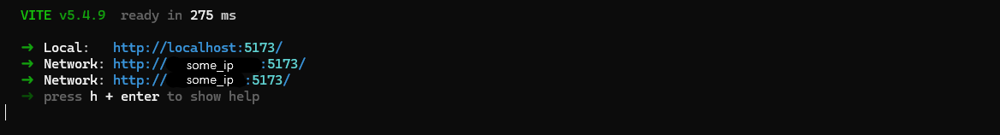
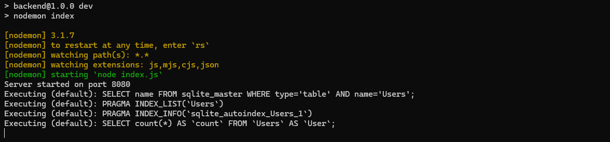
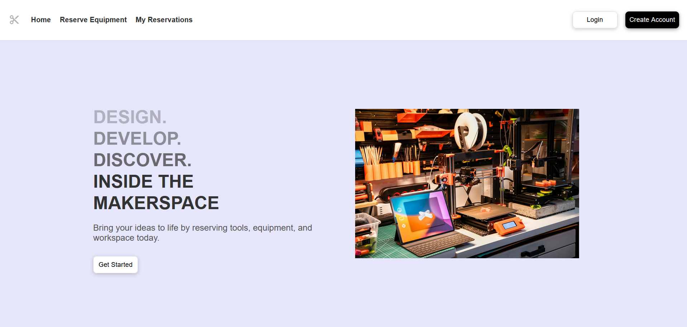

# Makerspace Management Portal

A program that allows students to reserve and view available equipment in the university's makerspace -- students can see available times and report issues with equipment, while admins can accept or deny bookings, and set equipment status. Watch a GIF of me interacting with it below!

[]

Interested in learning more? Click [here](https://drive.google.com/file/d/166LxzKaVnde0scdmqk1s0WQN2wszqNO4/view?usp=sharing) to see a showcase of the entire website.

Want to see some of the technical details and explanation of the code behind the project? Click [here](https://drive.google.com/file/d/1nT2A-kkFWXPrl19oSGhr4a-unjOmnsBV/view?usp=sharing)!

## Features

- Navigate to the directory you want to store the project files in and clone the repository by running:
  ```
  git clone https://csgit.ucalgary.ca/carter.marcelo/seng513-fall24-group-16.git
  ```
- Go to the project root:
  ```
  cd seng513-fall24-group-16
  ```
- Confirm you are on the production branch by running:
  ```
  git checkout main
  ```
- In backend/seed.js, set the value of the variable 'clear' to true if you want to clear and seed backend/database.db every time the backend starts, otherwise leave it as false.

## Local Development Servers
- In frontend/src/axios.ts, find the constant 'axiosInstance' and set the value of 'baseURL' to `http://localhost:8080`.
- Open two terminals and navigate to the frontend folder in one and the backend folder in the other.
- In the frontend terminal, run:
  ```
  npm install
  npm list
  ``` 
- Confirm the output of npm list matches the following:
  ```
  +-- @emotion/react@11.13.3
  +-- @emotion/styled@11.13.0
  +-- @eslint/js@9.15.0
  +-- @fontsource/roboto@5.1.0
  +-- @mui/base@5.0.0-beta.61
  +-- @mui/icons-material@6.1.7
  +-- @mui/lab@6.0.0-beta.15
  +-- @mui/material@6.1.7
  +-- @mui/x-date-pickers@7.22.2
  +-- @types/js-cookie@3.0.6
  +-- @types/node@22.9.0
  +-- @types/react-dom@18.3.1
  +-- @types/react@18.3.12
  +-- @vitejs/plugin-react@4.3.3
  +-- axios@1.7.7
  +-- dayjs@1.11.13
  +-- eslint-plugin-react-hooks@5.1.0-rc-fb9a90fa48-20240614
  +-- eslint-plugin-react-refresh@0.4.14
  +-- eslint@9.15.0
  +-- globals@15.12.0
  +-- js-cookie@3.0.5
  +-- react-dom@18.3.1
  +-- react-router-dom@6.28.0
  +-- react-swipeable@7.0.2
  +-- react@18.3.1
  +-- sequelize@6.37.5
  +-- typescript-eslint@8.15.0
  +-- typescript@5.6.3
  `-- vite@5.4.11
  ```
- In the backend terminal, run:
  ```
  npm install
  npm list
  ``` 
- Confirm the output of npm list matches the following:
  ```
  +-- bcrypt@5.1.1
  +-- cookie-parser@1.4.7
  +-- cors@2.8.5
  +-- dollars-to-cents@1.0.3
  +-- dotenv@16.4.5
  +-- express@4.21.1
  +-- js-cookie@3.0.5
  +-- jsonwebtoken@9.0.2
  +-- morgan@1.10.0
  +-- nodemon@3.1.7
  +-- pluralize@8.0.0
  +-- sequelize@6.37.4
  +-- sqlite@5.1.1
  +-- sqlite3@5.1.7
  +-- stripe@17.3.1
  `-- util@0.12.5
  ```
- Run `npm run dev` in both terminals.
  - The frontend terminal should look similar to this:
    
  - The backend terminal should look similar to this:
    
- Open a browser and go to http://localhost:5173/
  - If this link doesn't work, try selecting one of the other links displayed in the frontend terminal.
  - The page should look like this:<br>
    <div style="border: 1px solid black;"></div>

## Docker Containers
- Optional: confirm that you can run the project on local development servers as detailed above before attempting to run it in Docker.
- Launch Docker Desktop.
- In frontend/src/axios.ts, find the constant 'axiosInstance' and set the value of 'baseURL' to `http://localhost:5001`.
- Open a terminal and navigate to the project root.
- Build the images by running:
  ```
  docker-compose build
  ```
- Run the containers by running:
  ```
  docker-compose up
  ```
- Open a browser and go to http://localhost:8800/.
  - The page should look the same as above.
